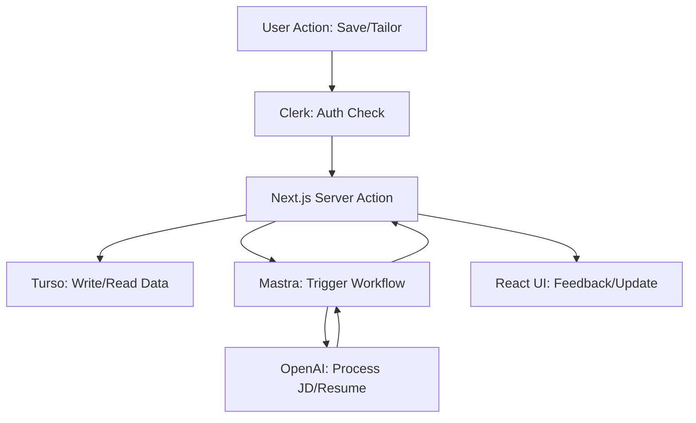

# Architecture Patterns: Milestone 2 - Pro Upgrade

**Domain:** Resume Builder SaaS
**Researched:** February 2025

## Recommended Architecture

### Component Boundaries

| Component | Responsibility | Communicates With |
|-----------|---------------|-------------------|
| **Identity Service (Clerk)** | User authentication, session management. | Next.js Middleware, Server Actions. |
| **Persistence Layer (Turso)** | Relational data storage (Drizzle ORM). | Server Actions, API routes. |
| **Workflow Engine (Mantra)** | Multi-step AI tasks (Tailoring, Scoring). | Turso (context), OpenAI SDK. |
| **PDF Generator (@react-pdf)** | Modular rendering of resume data. | Client-side/Server-side preview components. |

### Data Flow



## Patterns to Follow

### Pattern 1: Atomic PDF Design
**What:** Build PDF templates from reusable atoms/molecules.
**Why:** To support multiple templates (Creative, Executive, etc.) without duplicating logic.
**Example:**
```typescript
const ExperienceItem = ({ role, company, bullets }: ExperienceProps) => (
  <View style={styles.item}>
    <Text style={styles.role}>{role}</Text>
    <Text style={styles.company}>{company}</Text>
    {bullets.map(b => <BulletPoint key={b.id}>{b.text}</BulletPoint>)}
  </View>
);
```

### Pattern 2: Junction-Based Versioning
**What:** Store "Tailored Resumes" as lists of pointers to "Master Resume" items.
**Why:** Avoids duplicating data and allows "Source of Truth" updates to propagate easily (unless overridden).

## Anti-Patterns to Avoid

### Anti-Pattern 1: Large JSON Blobs in DB
**What:** Storing the entire resume as a single JSON column in Turso.
**Why bad:** Makes it difficult to query specific "bullets" for AI matching or to track version differences.
**Instead:** Use a relational schema with `resumes`, `experiences`, and `bullet_points`.

## Scalability Considerations

| Concern | At 100 users | At 10K users | At 1M users |
|---------|--------------|--------------|-------------|
| **DB Latency** | Direct Turso queries. | Turso Edge replicas. | Database-per-user (Turso Multi-DB). |
| **PDF Rendering** | Client-side in browser. | Client-side. | Server-side background jobs for large batches. |
| **AI Costs** | GPT-4o-mini for all tasks. | GPT-4o-mini / Local LLMs. | Hybrid caching of common JD analyses. |

## Sources
- [Modular Design Patterns](https://atomicdesign.bradfrost.com/)
- [Turso Architecture Best Practices](https://turso.tech/docs)
- [React PDF Patterns](https://react-pdf.org/)
